# Re:ゼロから始めるPython環境

作者：<Darren_Daniel_Day@hotmail.com>

本文章主要解答Windows中的python环境问题（也涉及一些常见的Windows下的操作）。在不做特殊说明的情况下，本文中说的操作系统环境是64位 Windows10 家庭中文版。Windows10的其他版本，如企业版、个人专业版中的操作也差不多，都可以参考本文。如果您是Windows7的用户，笔者建议您早日升级到win10，因为微软已经于2020.1.14宣布停止对Windows7的维护。

 此外，本文假设您使用python官方的解释器安装程序。如果您使用Jupyter Notebook或者Anaconda等其他带有python解释器的工具，您也可以参考本环境配置教程，但可能会存在一定障碍。

3.8.1官方安装包下载地址：<https://www.python.org/downloads/release/python-381/>

本文内容较多，但都比较详细。如果您对以下基础概念有一定的了解，您可以适当跳过。如果您对这些概念并不是很清楚，或者是对计算机都比较陌生的初学者，建议您仔细阅读全文。

> 授之以鱼不如授之以渔。仔细阅读理解本文后，您将能够较好地理解如何配置python环境，并能掌握一定的解决环境问题的知识。

## 目录/结构概览

* 基础概念
  * 可执行文件
  * 批处理文件
  * 终端
    * 命令提示符
    * WindowsPowershell
  * DOS命令
    * 命令
    * 参数
    * 选项
  * 环境变量
    * Path
* 理解Python的环境问题
  * 解释器
    * 使用交互模式运行解释器
    * HelloWorld程序
    * 使用命令行运行脚本
    * 文件关联
  * 包安装与管理程序
    * 基本用法
    * 使用镜像
* Python的编辑器
  * IDLE
  * VSCode
  * Pycharm

## 基础概念

### 可执行文件

可执行文件是那些可以运行的文件，或者说就是一个程序。他们的文件名通常以`.exe`结尾。通常您可以在windows资源管理器中找到他们，然后直接双击打开运行。他们的内容往往是机器码，如果尝试用记事本打开，您将会看到一堆无法理解的乱码字符。

### 批处理文件

批处理文件也像可执行文件那样可以被双击运行，但他们的内容往往是纯文本，能够阅读，并且包含一些批处理命令。他们的文件名通常以`.bat`结尾。

### 终端

以下几个名称的区别不大。

终端-Terminal/控制台-Console/命令行-Command Line

本文中将其解释为运行命令提示符或WindowsPowershell时产生的窗口。

#### 命令提示符

即cmd.exe。

命令提示符是一个可执行文件。您可以在开始菜单中搜索cmd找到它。运行它将产生这样一个黑色窗口：


#### WindowsPowershell

Windows Powershell也是一个可执行文件。您可以在开始菜单搜索powershell找到它。运行它将产生这样一个蓝色窗口：

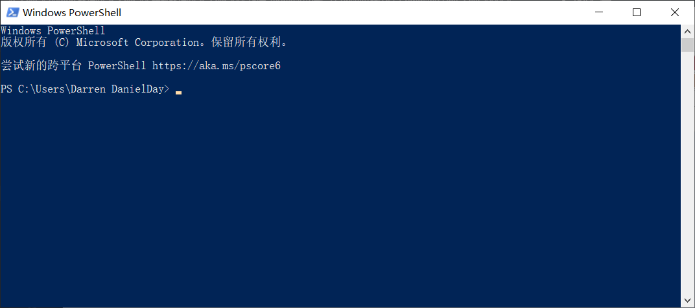

就基本功能而言，powershell和cmd差不多，但是用powershell可以执行linux下的命令，而cmd只能执行windows下的命令。

### DOS命令

有关DOS命令的概念，您可以参考百度百科：<https://baike.baidu.com/item/DOS%E5%91%BD%E4%BB%A4>

在这里笔者简单介绍一下DOS命令里的一些概念。

#### 指令

本文中的指令是指一条完整的、可以被命令提示符执行的文本。您可以在命令提示符中输入以下内容，并按下回车键执行。

```sh
echo hello
```

这条指令简单地输出一个hello。

#### 命令

本文的命令指的是在终端内输入指令中的第一个空格前的内容。

例如安装requests库的指令：

```sh
pip install requests -i https://pypi.tuna.tsinghua.edu.cn/simple/
```

其中`pip`就是命令。

您可以暂时先不去管上述的指令的含义，因为这在后文有介绍。

通常，命令有三种：内部或外部命令、可执行文件、批处理文件。
对于后两者，.exe和.bat可以省略不写。后文将会介绍如何使用命令。

在大多数时候，我们也将命令和指令和命令行混为一谈，例如`执行一个命令行`这种说法，其实指的是`执行一个指令`，或`执行一个完整的命令语句`。您可以根据上下文自行辨识。

#### 参数

本文的参数指的是指令的命令后面的以空格分隔的各个内容。

例如上文指令中的`install`、`requests`、`-i`、`https://pypi.tuna.tsinghua.edu.cn/simple/`就是`pip`命令的四个参数。

#### 选项

本文中的选项指的是一种特殊的参数。他们往往以`-`开头。
例如上文中的`-i`就是一个选项。

选项可能和其他参数结合，形成特殊含义。例如上文的`-i`选项就是指定临时镜像源，并指定镜像地址为`https://pypi.tuna.tsinghua.edu.cn/simple/`。

也有不和参数结合（不带参数）的选项，例如：

```sh
pip --version
```

其中`--version`选项就没有和其他参数结合。

### 环境变量

环境变量的主要作用是存储DOS命令经常需要用到的路径。当您需要指定一个路径时，您可以通过这些变量的值来指定。这样，您就不需要每次执行指令都手打完整路径了。

您可以在指令中使用`%变量名%`来引用他们的值。例如下面的指令能输出您的用户文件夹路径：

```sh
echo %USER%
```

#### Path

环境变量Path是一个特殊的环境变量。它主要用于解析可执行文件和批处理文件的位置。您可以在开始菜单中搜索`环境变量`找到设置他们的地方，像这样：

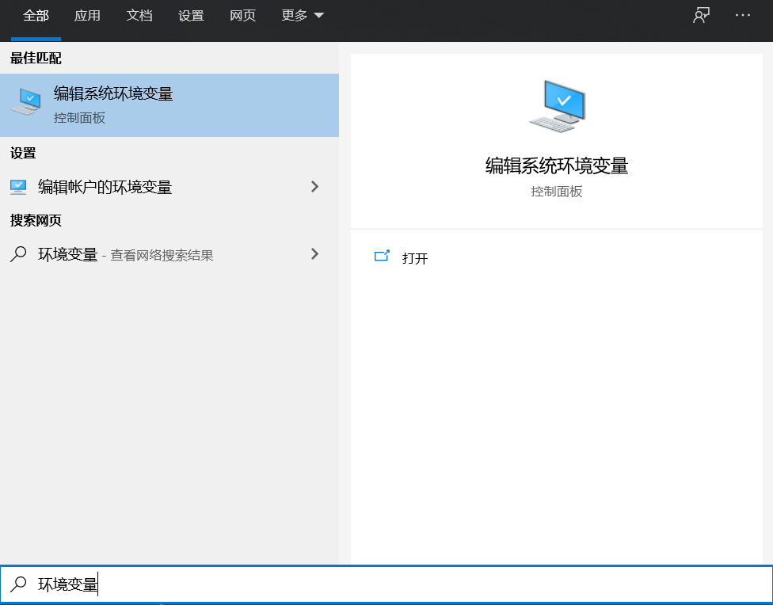
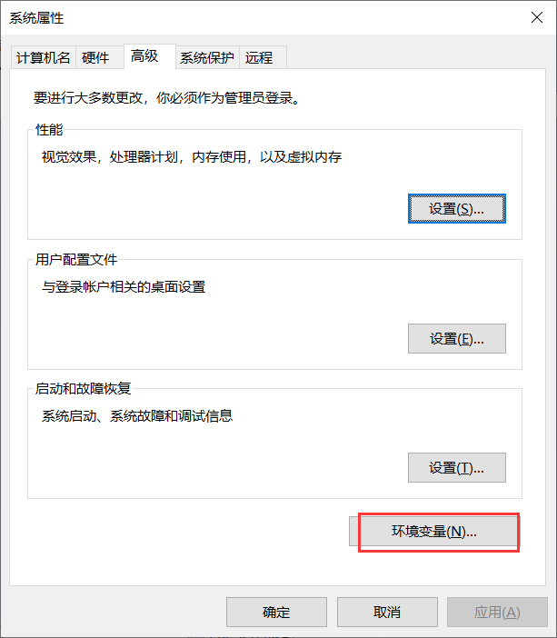
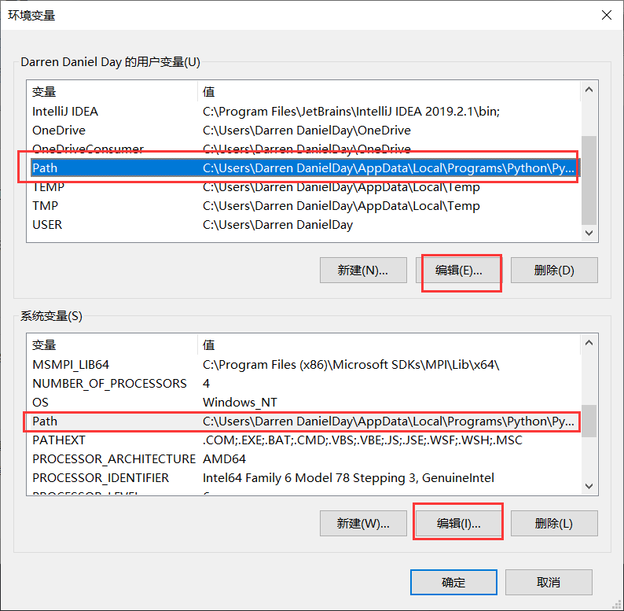

值得注意的是这里有两种Path环境变量，一种是用户变量，一种是系统变量。一般而言您只需要修改用户变量。

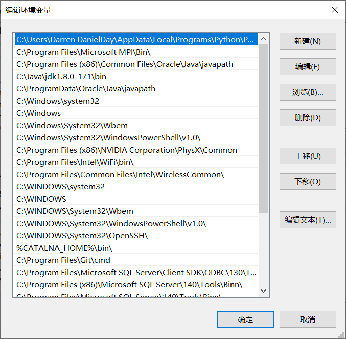

可以看到，这里展示的是一张表。如果您使用Windows7，那么这张表将会以一个用分号`;`分隔的纯文本展示。Win10下通过`编辑文本`按钮也可以看到这些文本。

Path的主要作用就是告诉命令行：这些文件夹是经常要用的，请在解析命令的时候在这些文件夹里搜索`可执行文件`和`批处理文件`。

因此，将python的安装位置文件夹加到Path将使得命令行能够解析里面的`python.exe`，或者简写的`python`。可见上图中笔者已经将python安装目录加入Path环境变量（可以在安装的时候勾选Add Python to Path，让安装程序自动帮您设置，如果忘记勾选可以手动添加）。

如果要添加一个Path中的路径，可以点击新建按钮，然后输入值。配置python需要两个路径，一个是python.exe所在文件夹，一个是该文件夹下的Script文件夹。

如果您在安装python解释器时是默认的安装位置，那它将在

```text
C:\Users\您的Windows登录用户名\AppData\Local\Programs\Python\Python版本号
```

下图简单演示了如何在命令行检查Path环境变量是否配置正确。如果在命令行中输入命令`python`能够进入python解释器的交互模式，则您已经成功配置好Path环境变量！

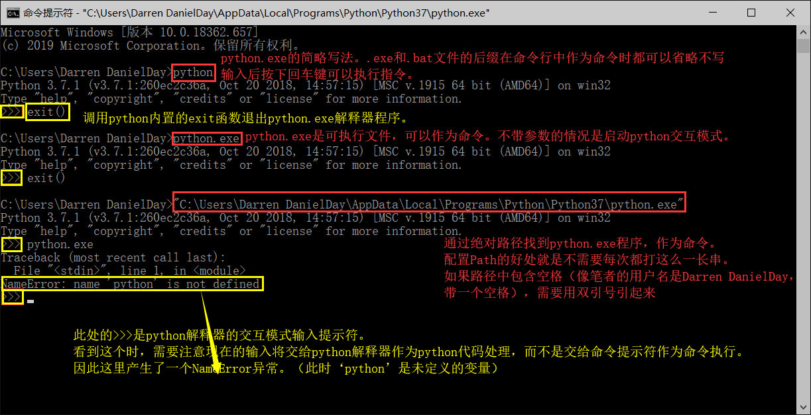

## 理解Python的环境问题

### 解释器

python解释器主要指python.exe。

python是解释型语言，其代码通过解释器解释后再运行。目前最流行的解释器是使用C语言实现的解释器。如果您是通过python官方的安装程序安装python解释器（是用C语言实现的解释器），那么，您可以在python安装目录下的include文件夹中找到相关的C语言的头文件（.h文件）。

但python.exe只是一个主程序，单独的python.exe并不能完成整个python解释器的工作，它还需要其他链接库文件才能工作。因此，python.exe就像一个解释器启动器一样。

python解释器的主要作用是解释并运行python代码。

#### 使用交互模式运行解释器

前文的图片中已经简单地介绍了一下交互模式的启动方式。在交互模式中，您将会经常看到`>>>`和`...`。他们都是交互模式的输入提示符，只不过`>>>`用于表示当前位置是语句的开始，`...`表示当前行是拆行书写的同一语句或者若干子句。

如果您成功配置了环境变量，您可以在命令行执行以下指令：

```sh
python
```

来进入交互模式。大致效果如下图。

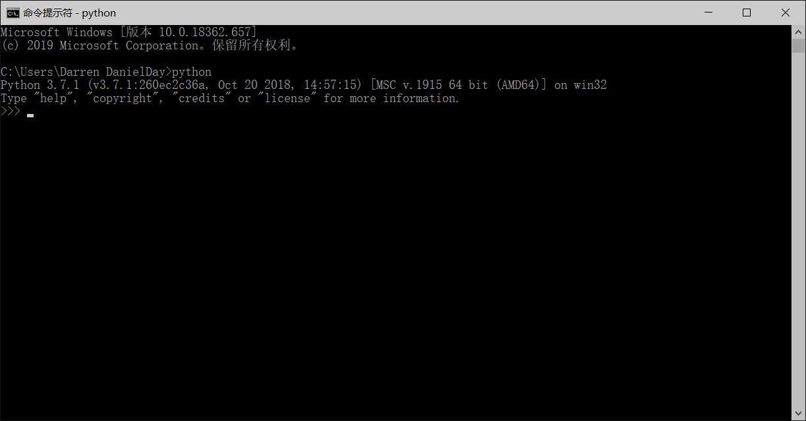

您也可以直接在开始菜单搜索并运行python解释器程序进入交互模式。大致效果如下图。

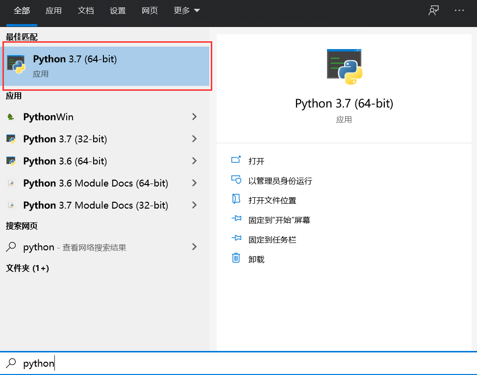
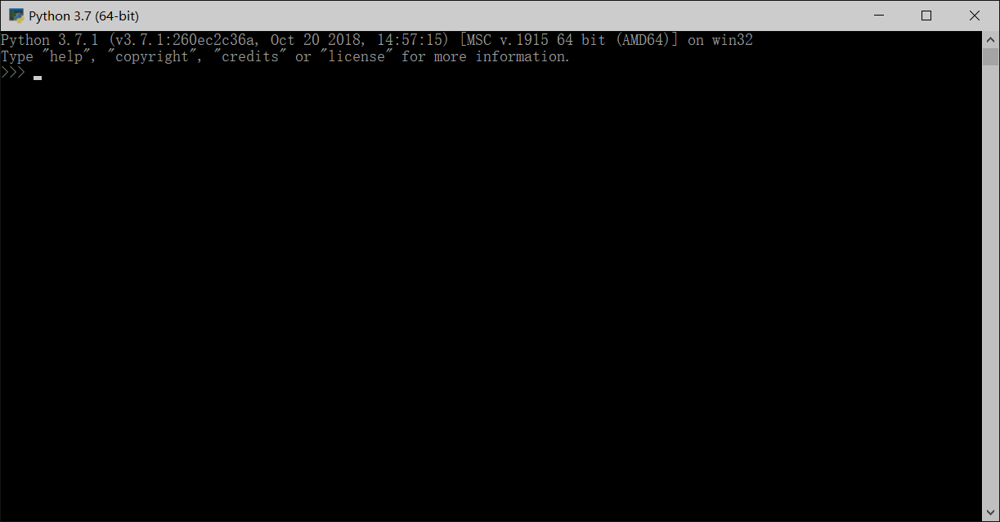

#### HelloWorld程序

学习任何一门编程语言总是离不开那么一个`Hello World`程序，这一点对于python也是一样的。

python的`Hello World`代码很简单：

```python
print('Hello, world!')
```

您可以在交互模式下输入以上代码，并按下回车键。您将看到一句`Hello, world!`的输出。

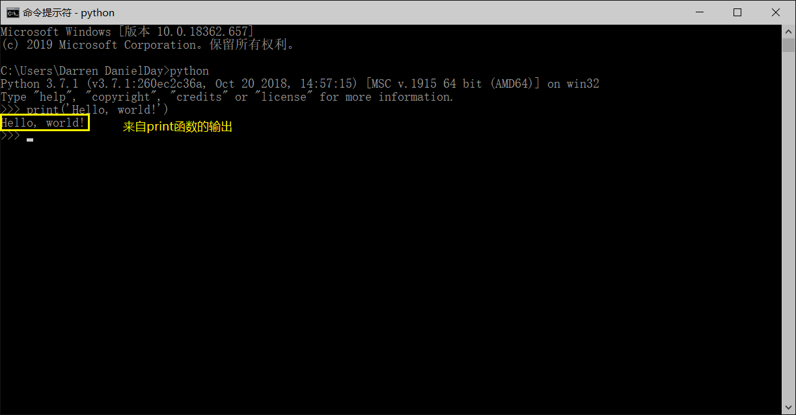

您可能还有些疑问，比如print函数是什么，`'Hello, world'`是什么，括号有什么含义，为什么会有输出。在本文中，这些并不是很重要，因为这是python的语言知识。而到此为止，您已经完成了您的第一个python程序！

#### 使用命令行运行脚本

如果每次运行python代码都要这样手打一遍，您一定会觉得麻烦。因此，您可以将这些代码写成`脚本文件`，并运行他们。下面将简单演示如何写脚本文件并运行他们。

在Windows资源管理器中选择一个您喜欢的个人文件夹（或者新建一个文件夹），以便于管理您的python脚本。此处笔者的示例中在C盘新建了一个python_coding文件夹。

接下来您可以在您的个人文件夹中创建一个文本文件，将其命名为`helloworld.txt`。如果您看不到文件的扩展名（.txt后缀），可以通过`查看`->勾选`文件扩展名`来显示他们。

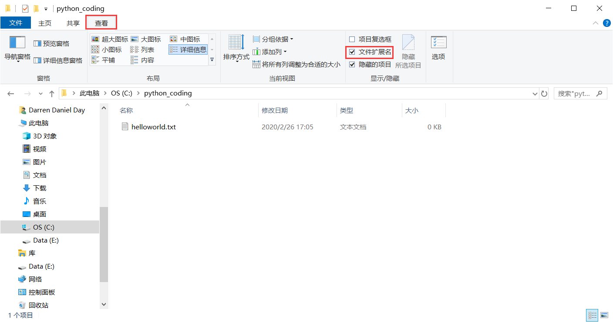

接下来您可以用记事本打开它，并在里面写入`Hello World`程序的代码：

```python
print('Hello, world!')
```

并将其保存。接下来您可以在这个文件夹的地址栏输入`cmd`并按下回车键（注意需要覆盖掉全部地址）。您将看到被打开的命令提示符，并且当前路径为您的个人文件夹。

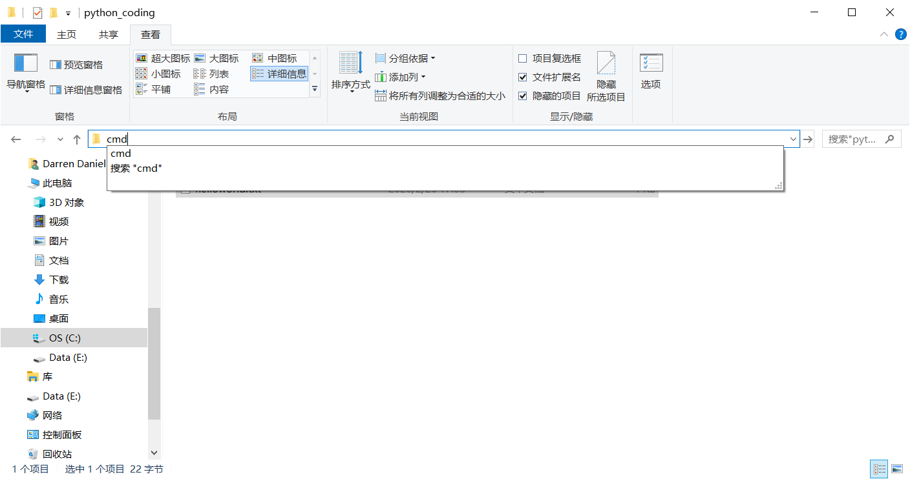
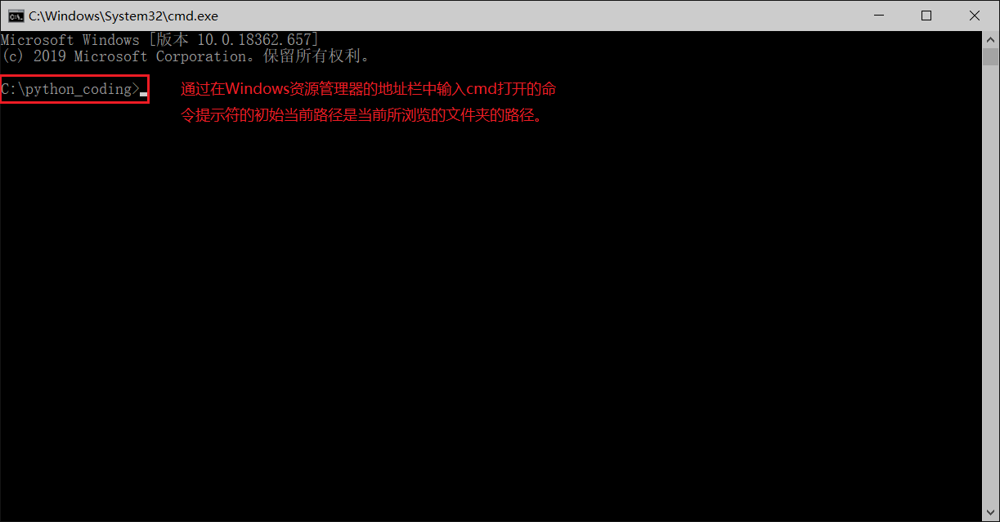

接下来在命令提示符中执行以下指令：

```sh
python helloworld.txt
```

您将大概看到这样的结果：

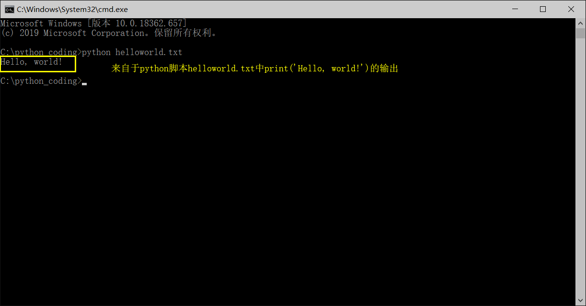

至此，您已经成功地在命令提示符运行了`Hello World`程序的python脚本！

不过在习惯上，我们总是将python脚本命名成`.py`后缀。您可以将`helloworld.txt`的文件名修改成`helloworld.py`，然后执行命令

```sh
python helloworld.py
```

其效果是一样的，因为python脚本文件其实就是纯文本。

> 请注意，如果不进行`.py`后缀命名，将导致该脚本无法被python的`import`语句正常导入。您现在也许不必关心`import`语句是什么，但您应当明白命名成`.py`后缀是更好的。

在下面的例子中，脚本已经被笔者重命名成`.py`后缀。

如果您通过开始菜单打开命令提示符，您可以使用`绝对路径`找到您的脚本文件，并运行。

```sh
python C:\python_coding\helloworld.py
```

您将看到以下结果。

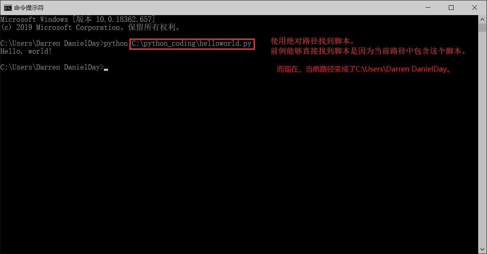

您也可以使用下面的指令来改变当前路径为您的个人文件夹。

```sh
cd C:\python_coding
```

`cd`是`change directory`的英文缩写，其作用是跳转终端的当前路径。其参数可以是绝对路径，也可以是相对路径。此处使用了绝对路径。

然后您将可以使用指令

```sh
python helloworld.py
```

来运行您的脚本。图略。

对于初学者，笔者建议多使用**交互模式**。使用交互模式的好处是您可以和解释器频繁交互，及时得到python解释器的反馈，并且产生的**异常不会终止解释器程序**。因此使用交互模式来探索python是最快的，即使您在学习过程中会有许多磕磕绊绊。当您对python基础知识的熟悉程度达到一定水平的时候，您可以通过写脚本来构建更大的程序和系统。

#### 文件关联

如果您将python解释器和`.py`文件进行了关联，您将可以通过直接双击.py文件运行他们。文件关联可以理解为文件的默认打开方式，而这个打开方式就是一个可执行文件。

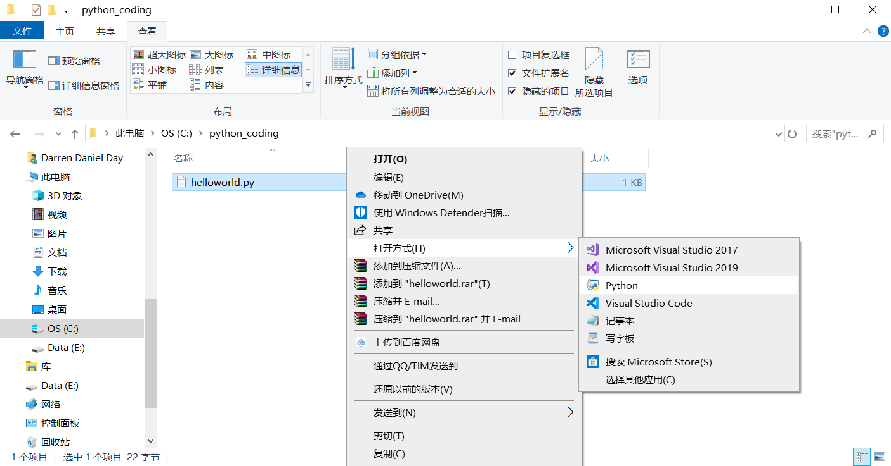

笔者没有进行python解释器和`.py`文件的关联（笔者将`Visual Studio Code`和`.py`文件进行了关联），因此通过在打开方式中选择python解释器来打开它。

但是您可能看到一个窗口一闪而过，然后就消失了。这是因为python解释器执行完脚本就退出了，其控制台窗口也自然被关闭。

如果您想要看到窗口中的输出内容，您可以选择在命令提示符中执行您的脚本,而不是通过文件关联的双击运行，或者您也可以在代码中增加具有阻塞性质的内容。对于后者，您可以使用`input`函数等待输入来进行阻塞，也可以使用`os`模块的`system`函数执行一个`pause`命令。下面是改写后的两个脚本内容：

```python
print('Hello, world!')
input('输入任何按下回车键关闭......')
```

```python
import os
print('Hello, world!')
os.system('pause')
```

### 包安装与管理程序

python的最大优点就是第三方库丰富易用。因此，学会安装和配置第三方库也很重要。而安装第三方库最主要的工具就是pip。

pip的主体也是个可执行文件（pip.exe）。如果您在安装python解释器时勾选了pip，您可以在python的安装目录下的Scripts文件夹中找到它。

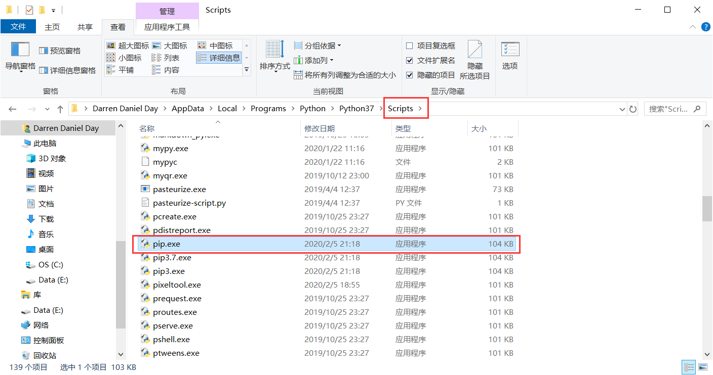

如果您没有安装pip，您可以重新安装python解释器并勾选pip。或者您可以参考这里:<https://pip.pypa.io/en/stable/installing/>。网页是英文的，如果您有阅读障碍，请使用翻译。

您可以通过指令

```sh
pip --version
```

来检查您是否正确配置了使用pip需要的Path 环境变量。如果您看到了您的pip版本，则说明您已经成功配置环境变量。如果没有，您需要手动配置Path环境变量。如果您认真阅读并理解了前文的配置Path相关内容，您应当有能力自行配置。

#### 基本用法

首先，您需要知道您要安装的第三方库的名称。此处以比较常用的网络请求库requests为例。

您可以在pip的官网：<https://pypi.org/>搜索您要安装的第三方库。

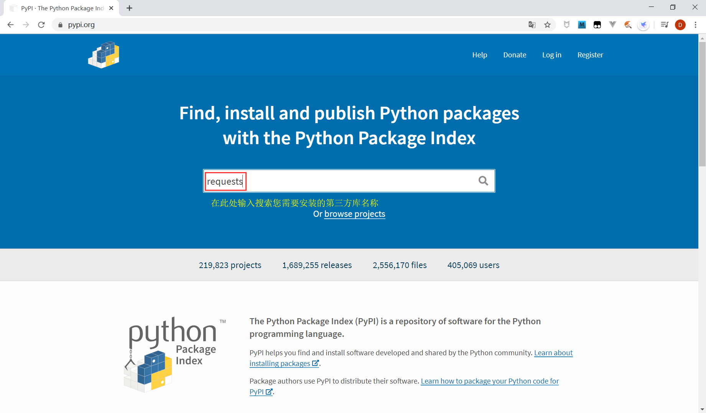
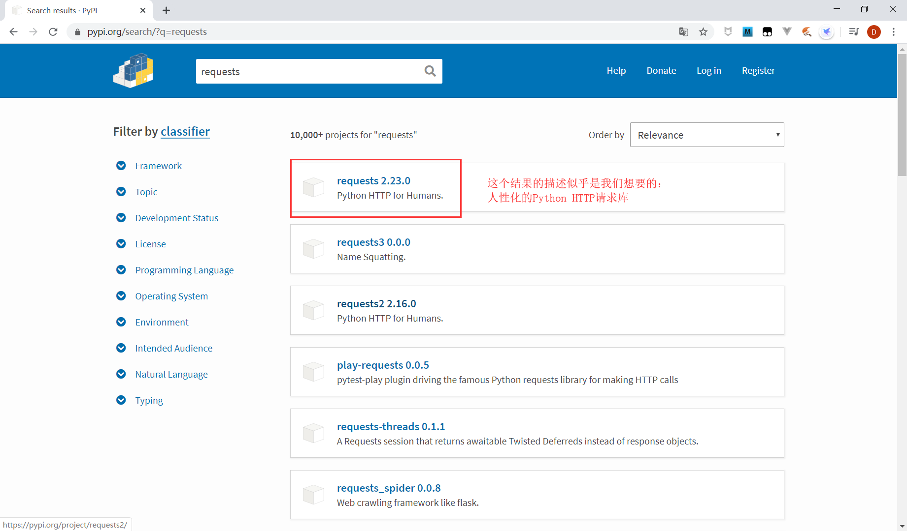
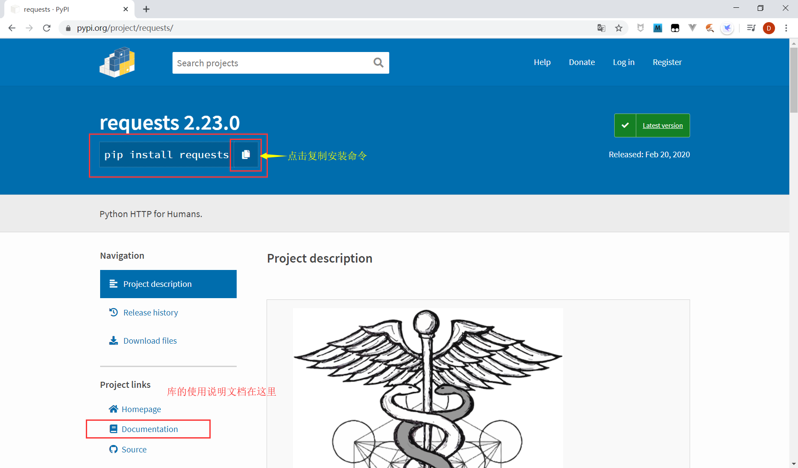

值得一提的是，您可以在pypi找到第三方库的使用文档，这非常重要。看10个国人做的快速入门教程不如好好读一遍库原作者的文档。

找到安装指令后，您可以在命令提示符执行它。当然，由于笔者已经安装了requests库，所以看到的是一堆`Requirement already satisfied`（安装需求已经满足）。

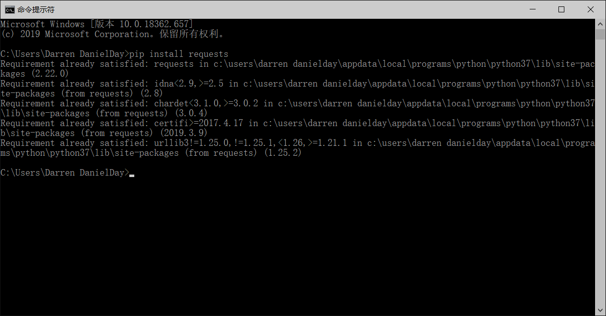

您可以使用指令

```sh
pip --help
```

来查看pip的用法。

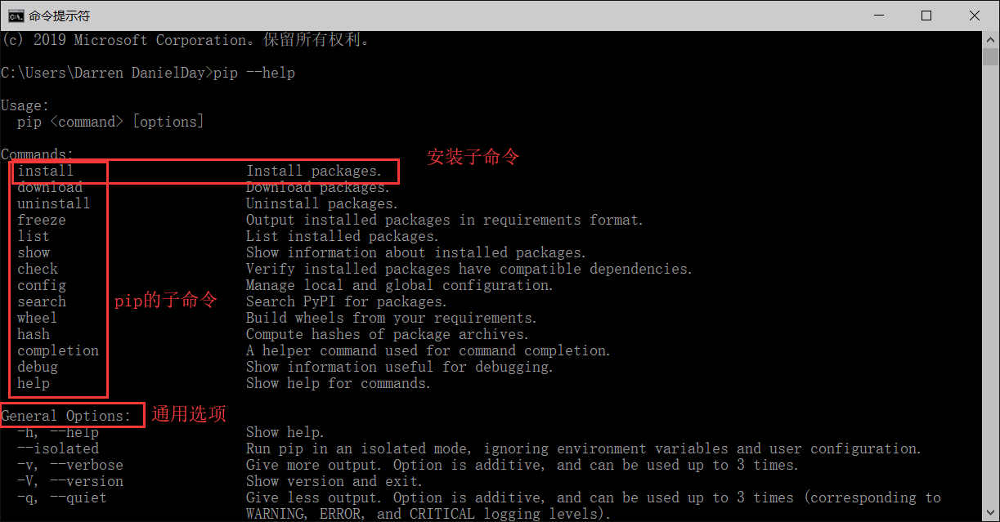

在张表里，`install`是命令`pip`的一个可用参数，不过在指令执行的时候被解释成一个子命令。

如果您想进一步知道子命令`install`的用法，您可以使用指令

```sh
pip install --help
```

来查看。

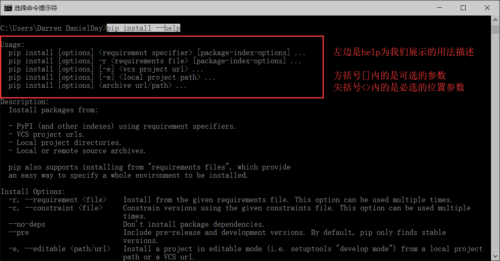

您可能认为笔者应当直接教学如何使用pip，而不是展示如何阅读这些帮助。但笔者认为，学会阅读这些对您解决问题的水平提升会带来很大帮助。

根据上图的第一个用法，我们可以得出最简单的用法：

```sh
pip install <requirement specifier>
```

即方括号内的可选参数都不给，只给一个`requirement specifier`，“需求描述符”（即库的名字）。

前文运行过的`pip install requests`正是这种用法。

#### 使用镜像

如果您在安装过程中产生了网络超时错误，您应当考虑使用代理（翻墙）或者使用国内镜像。

您可以在install的help中找到使用镜像的方法。

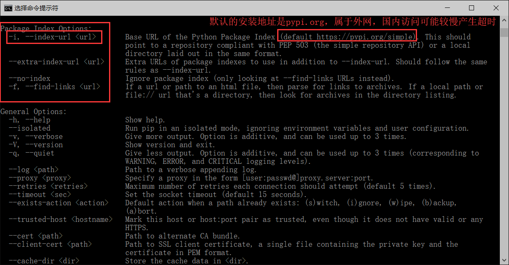

您可以使用以下的国内镜像地址：

1. 阿里云 <http://mirrors.aliyun.com/pypi/simple/>
2. 豆瓣 <http://pypi.douban.com/simple/>
3. 清华大学 <https://pypi.tuna.tsinghua.edu.cn/simple/>
4. 中国科学技术大学 <http://pypi.mirrors.ustc.edu.cn/simple/>
5. 华中科技大学 <http://pypi.hustunique.com/>

笔者一般使用的是清华大学的镜像。

如果您根据上文已经理解了pip的install子命令的用法，您不难得出使用清华大学镜像安装requests库的指令是

```sh
pip install requests -i https://pypi.tuna.tsinghua.edu.cn/simple/
```

或者

```sh
pip install requests --index-url https://pypi.tuna.tsinghua.edu.cn/simple/
```

如果您希望修改默认的安装地址为国内镜像，您可以参考这篇文章：<https://blog.csdn.net/sinat_21591675/article/details/82770360>

## Python的编辑器

现在您应当已经具备运行编写脚本代码和运行代码、安装第三方库的能力。但用记事本编写代码实在是令人无法接受，因为黑白界面不太好看，并且当代码量大起来以后，您将无法很好地阅读您的代码。

因此，您需要一个代码编辑器来简化一些操作，并提供更好的代码渲染视图。一个好的代码编辑器能助您事半功倍！

您可以根据个人喜好选择代码编辑器。如果您是编程的初学者，笔者建议您使用Visual Studio Code。

下面笔者将介绍三款能写python的代码编辑器的简单使用和环境配置相关事宜。

### IDLE

IDLE是python解释器自带的，也是官方推荐的初学者编辑器。最直白的缺点是界面并不是很好看（但比记事本好看点）。

如果您按照默认安装了IDLE，您可以在开始菜单中搜索IDLE并找到它。

打开后，您将大概看到这样的界面：

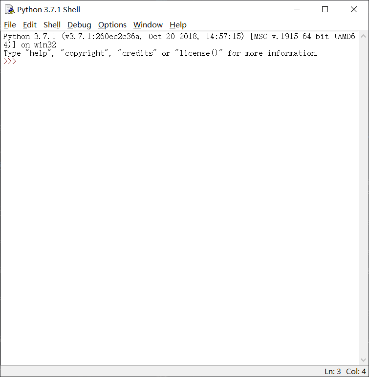

您可以看到熟悉的`>>>`。这表示您正在python交互模式当中。笔者将简单地键入几行python代码（当然最后的一行`?`是不合法的python代码），您大概会体会到IDLE的python交互模式和在命令提示符中的区别——代码的颜色不一样。这种对代码的颜色渲染有助于您更好地阅读代码。

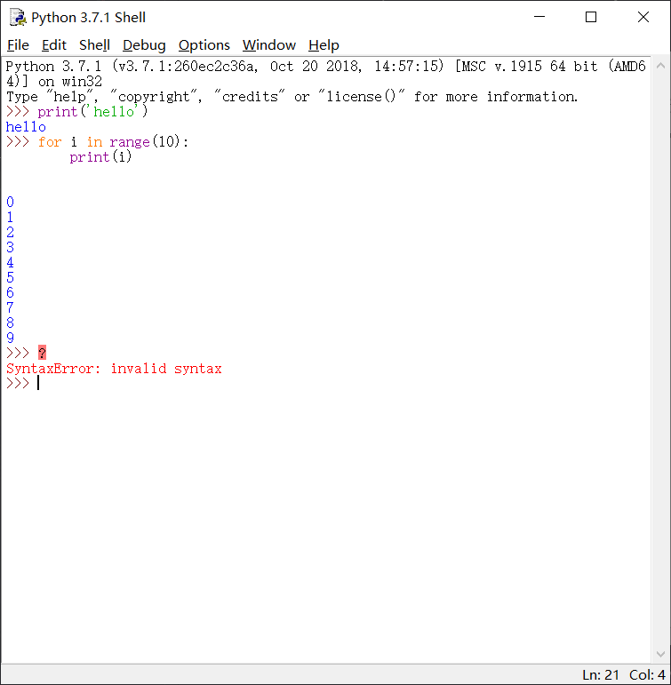

您可以通过点击菜单栏的`File`->`New File`来创建一个新的脚本文件。这将打开一个新的IDLE窗口。

当您创建脚本后，您将可以书写您的脚本代码，像在记事本中那样，只不过代码将被不同颜色渲染，可读性有所提升。

笔者写入了这样的代码：

```python
print('Hello, world')
name = 'Darren'
```

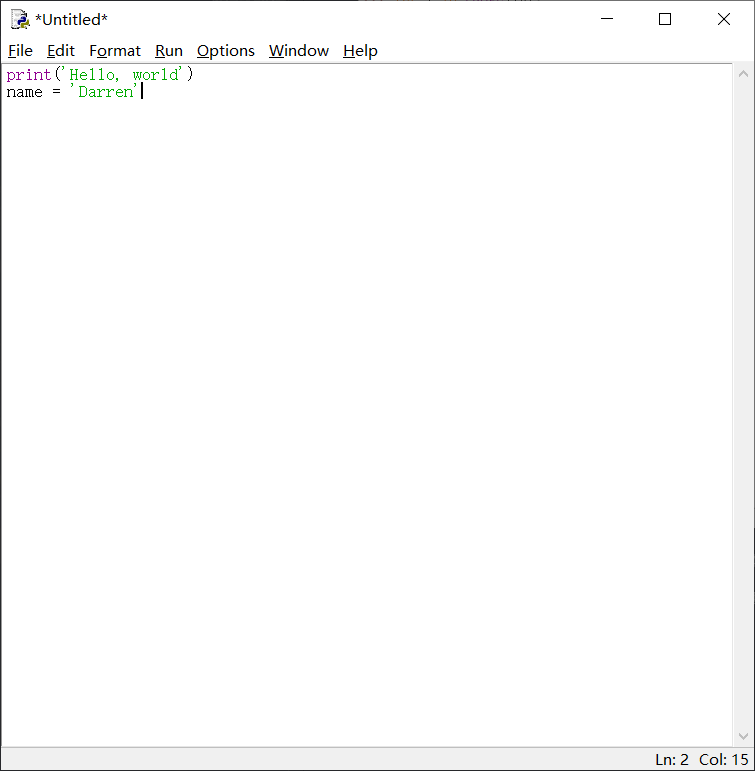

接下来您可以点击菜单中的`Run`->`Run Module(F5)`或者按下F5键来运行您的脚本。不过在那之前，您可能需要先选择一个位置保存您的脚本，IDLE会弹出这样的提示：

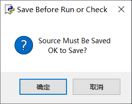

您只需简单确定并选择您的个人文件夹，并命名您的脚本。此处笔者选择了C:\python_coding文件夹，并将脚本命名为`idle_demo`。不必担心后缀名，IDLE将自动为您命名后缀为`.py`。

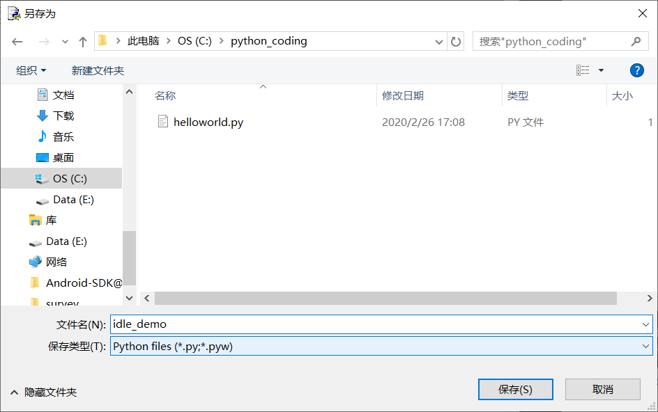

保存并运行后，您将看到print函数输出的结果：

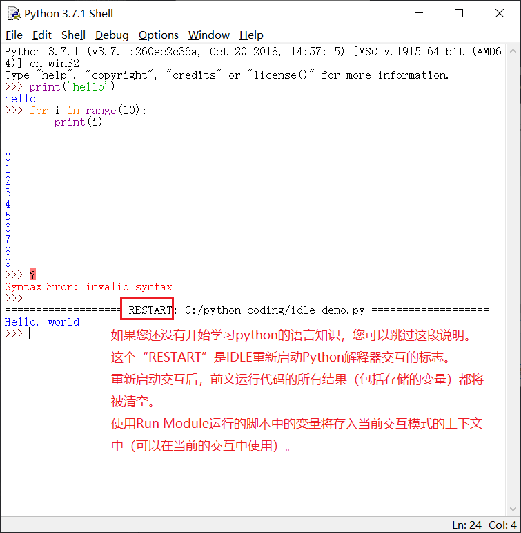

更进一步地，您也可以在python交互中使用刚才脚本中定义过的name变量，并带有代码提示（您可以输入一个n，并按一下Tab键，这将弹出如下图1的下拉菜单，此时选择第一个并按Tab键一次和回车键一次或两下Tab键将可以补全输入，帮您键入整个name），但Run Module运行脚本前的交互中由for循环定义的变量i将变成未定义的。

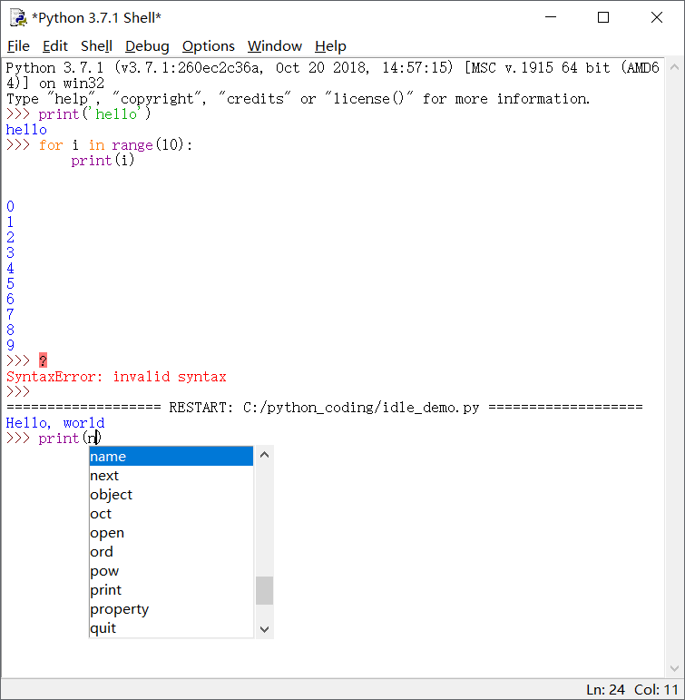
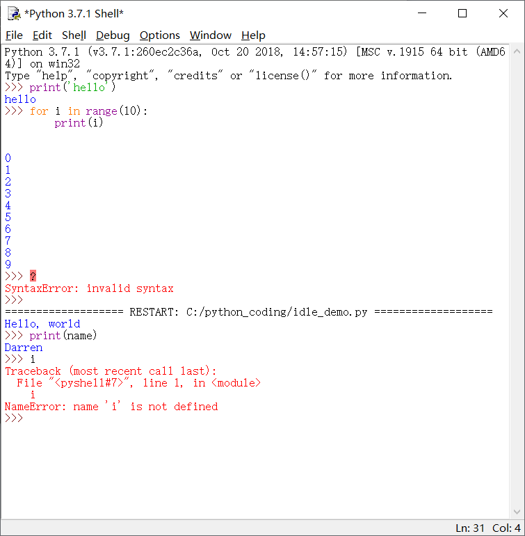

以上是简单的IDLE中的操作。如果您有兴趣，可以自行探索其他功能（例如格式化代码、调试、有趣的Turtle图形化库的官方示例代码等）。

### VSCode

Visual Studio Code（简称vscode）是微软开发的一款轻量的代码编辑器。她不是像Sublime Text那样的纯文本编辑，也不是像Visual Studio那样的大型集成开发环境，这一点使得大多数的开发者选择了她。更酷的是，她完全开源免费。您可以在GitHub上找到她的源码：<https://github.com/microsoft/vscode>。

您可以通过这个链接下载她：<https://code.visualstudio.com/Download>。

> Visual Studio Code使用微软开发的语言Typescript编写，其核心是`Chromium`（类似浏览器的内核）和`Electron`。vscode虽然本体功能不多，但其插件社区很大，**丰富的插件使得vscode变得强大**。

安装程序是中文的，您不必担心有太大的障碍。如果您不想做太多选择，您可以直接一路Next安装。安装完毕后，您可以启动她。对于写python脚本的需求，您需要两个插件。

* Python（必装，是python的语言支持插件）
* Chinese (Simplified) Language Pack for Visual Studio Code（可选，官方汉化包）

您可以在插件商店搜索这两个名字，并安装。大致步骤如下图。

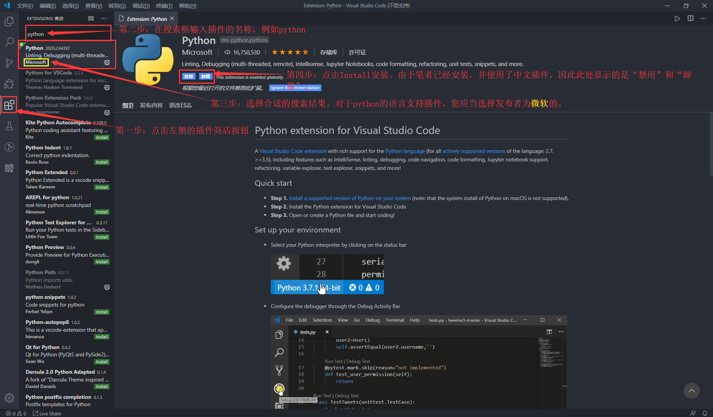

> 您的vscode外观颜色可能和笔者有所不同，因为笔者还安装了主题插件。您也可以根据个人喜好安装主题插件。笔者使用的主题插件是`One Monokai Theme`，配色相比默认深色主题更加柔和。

接下来，您可以打开一个文件夹，作为vscode的工作目录。笔者选择了前文的C:\python_coding文件夹。

> vscode可以使用文件夹作为工作目录，也可以打开工作区（需要工作区配置文件），也可以不打开而进行单纯的单文件代码编辑。笔者推荐使用`打开文件夹`作为工作目录，以方便脚本文件的管理。

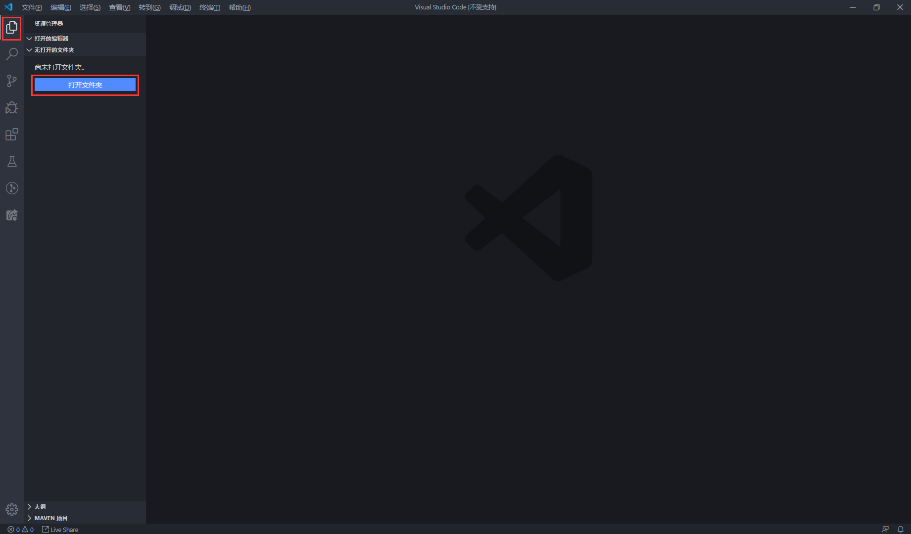

下面是简单的界面介绍：

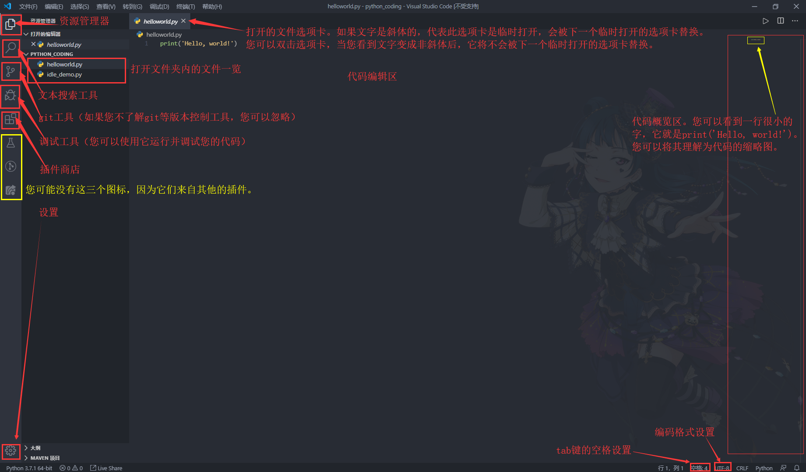

> 您可能注意到了背景图片`津岛善子 下界の儀式`。背景图片效果来自于插件vscode-background，如果您需要，您可以自行安装配置。

接下来几张图简单介绍如何在vscode中调试运行您的python脚本。

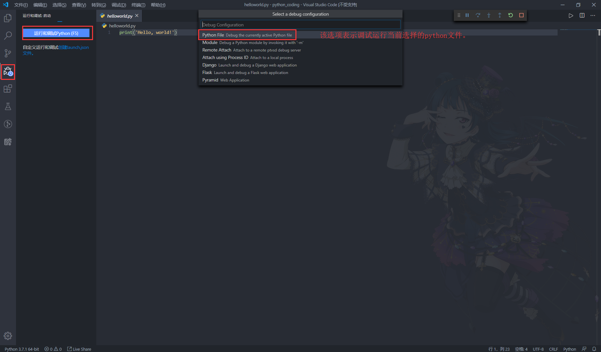
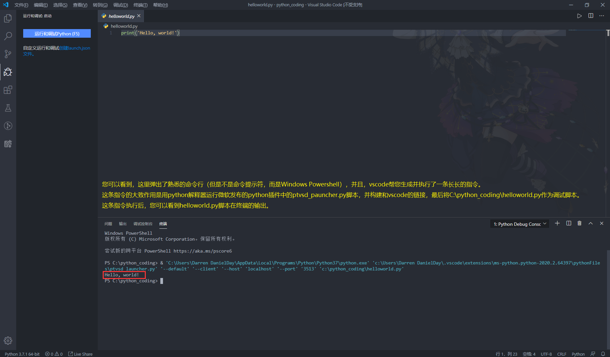

如果您发现频繁选择第一个`Python File`选项比较麻烦，您可以按照如下步骤添加配置文件。

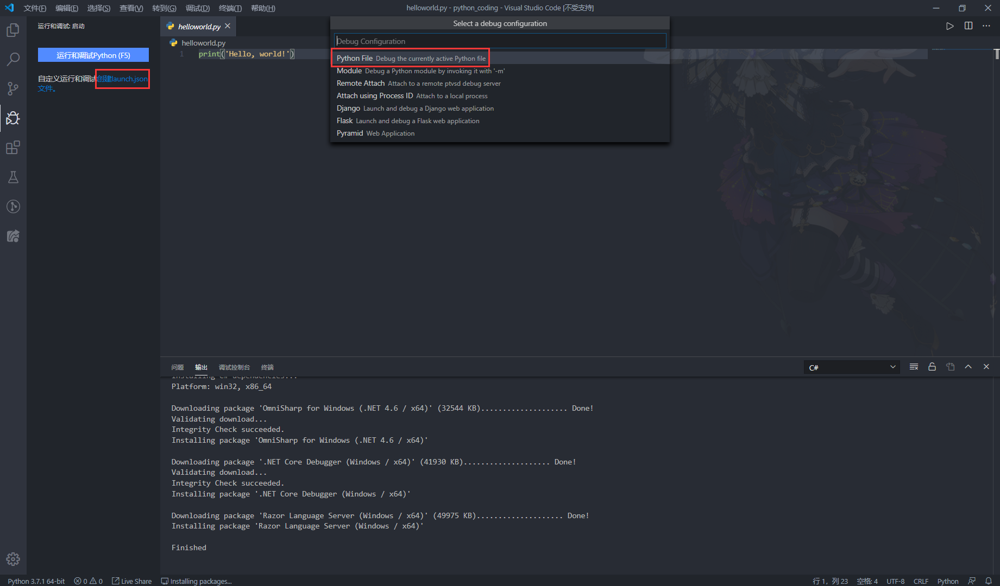
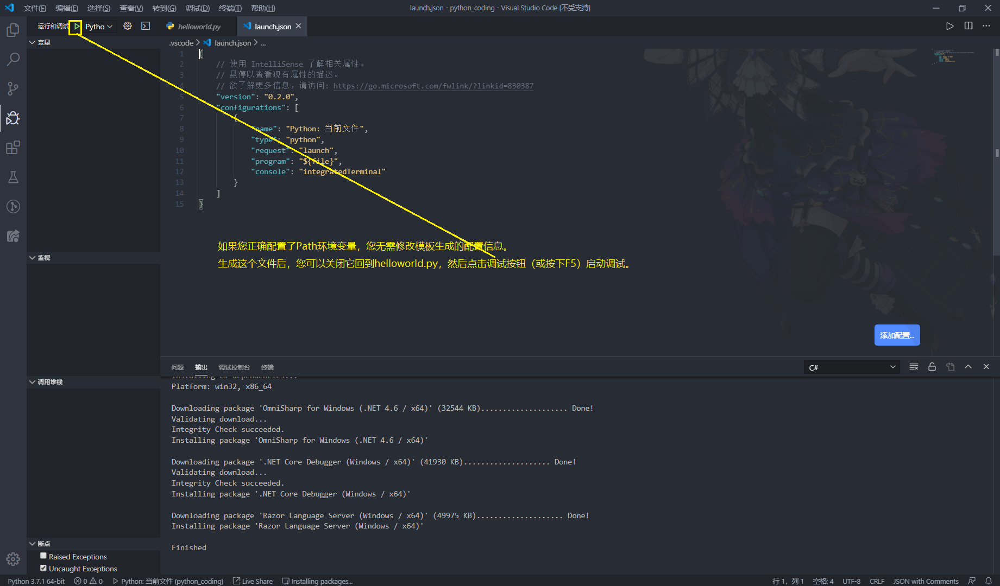

> 如果您认为这样的操作过于麻烦，您也可以安装code-runner插件，一键运行您的脚本。安装后，您将在右上角看到一个空心的小三角形图标。您可以使用它直接运行您当前选中的脚本。

接下来几张图将简单介绍使用vscode调试代码（Debug）的方法。

笔者将使用这样的python代码进行调试示例：

```python
a = "global variable a"


def function_1(a):
    print(a)


def function_2():
    function_1("another var")


if __name__ == "__main__":
    function_2()

```

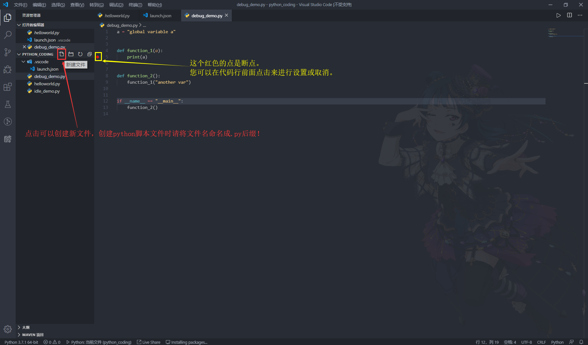

接下来按F5

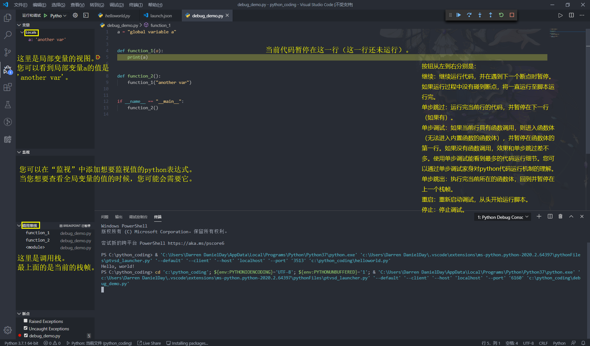
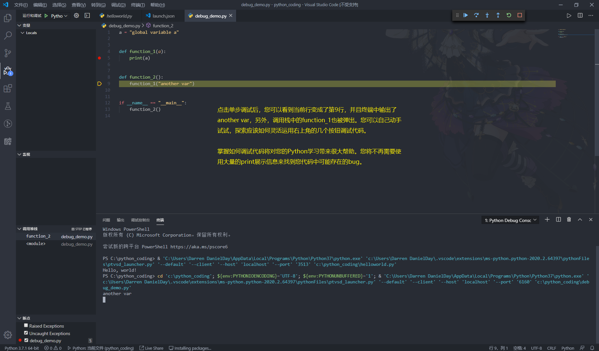

您也许会想到：不打断点的调试，其实就和直接运行差不多。确实如此。但是调试需要建立和vscode的连接，因此会比直接运行慢一点。您可以在终端中执行指令运行您的脚本，也可以借助code-runner插件，来直接运行您的脚本。

以上是对vscode写python的简单介绍，您可以自行探索其他功能，例如代码补全、代码格式化、快捷代码重构操作、文本搜索等。vscode还支持许多其他语言，例如主流的Java、C/C++、Javascript、HTML、C#等等。您只需安装相应的语言支持插件，就能够在vscode中编写他们！

### Pycharm

Pycharm是Jet Brains公司开发的一款python的IDE（集成开发环境）。它功能比较多，也比较专业，但同时也比较笨重、复杂，不适合编程的初学者。如果您正在使用的教程/课程使用的是Pycharm，您可以参考本文进行配置。

Pycharm有社区版（Community）和专业版（Professional），其中社区版是免费的，而专业版是收费的。专业版的功能比社区版的相对多一些。您可以在这里下载它：<https://www.jetbrains.com/pycharm/download/#section=windows>。

如果您选择了专业版，您将需要激活，或者免费试用一段时间。如果您是学生，您可以使用学生认证进行激活，并免费使用Pycharm到您毕业为止，可以参考这篇文章：<https://blog.csdn.net/qq_36667170/article/details/79905198>。如果您不是学生，又希望使用专业版，请考虑购买许可。**如果您尝试使用破解版，并对Jet Brains公司造成了损失而被追究责任，笔者概不负责**。

本教程将演示如何使用社区版。

安装选项您可以根据个人需要进行变更。安装完毕后打开，您将看到这样的界面：

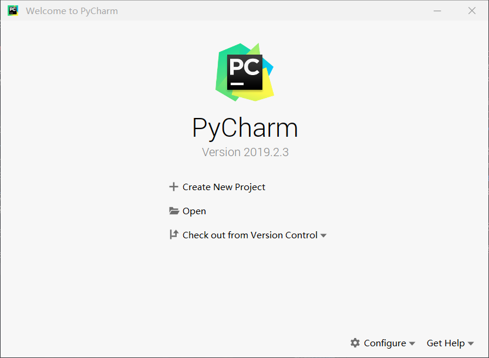

您可以选择第二个选项，打开一个文件夹，这和vscode有些相似。您也可以选择第一个选项新建一个项目。在这里，笔者将展示创建项目。

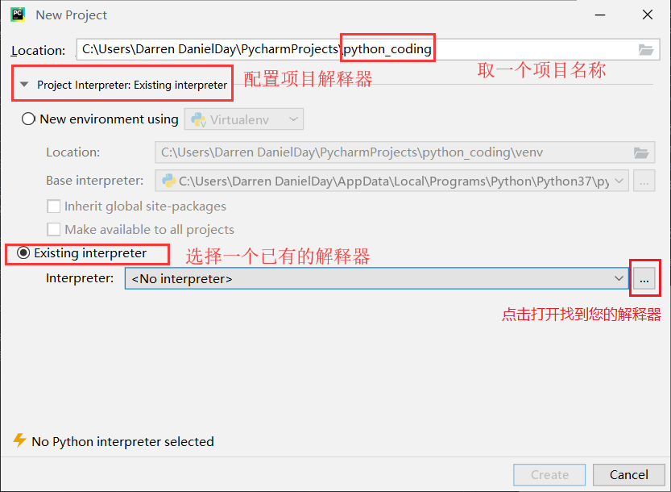
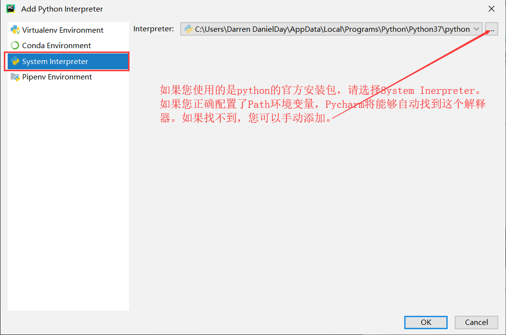

选好解释器后点击create。进入后您将大致看到这样的界面。

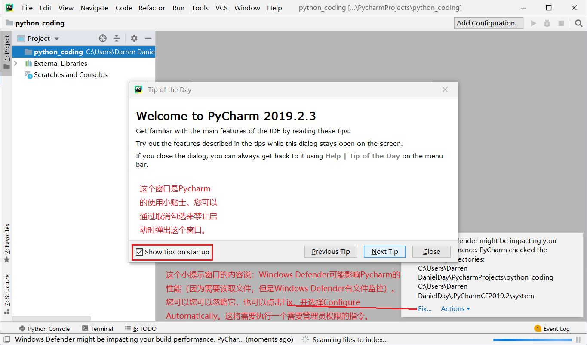

您可以在项目中新建一个脚本文件。笔者在此使用的脚本代码和vscode中的示例一样。

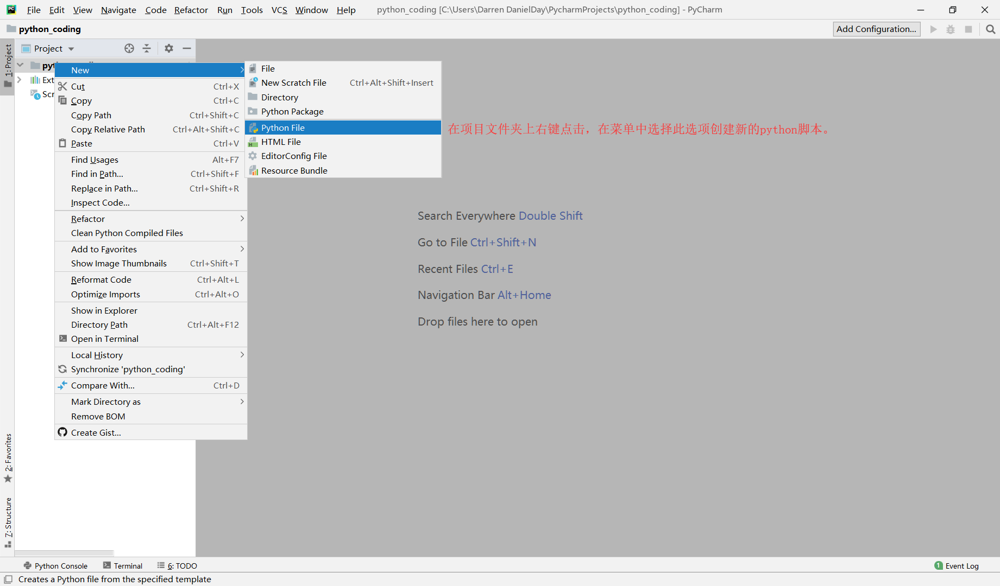
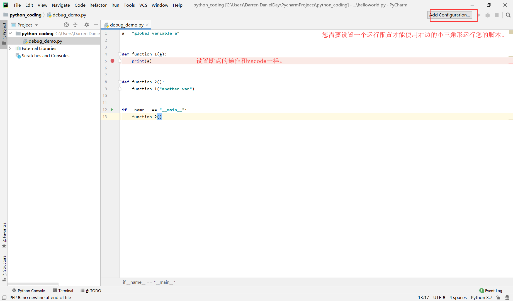

如果您在创建项目的时候选择了虚拟环境（如果您没有看上述教程，而是按照默认创建了项目，则会有一个虚拟环境），您可以在设置中修改项目的解释器：

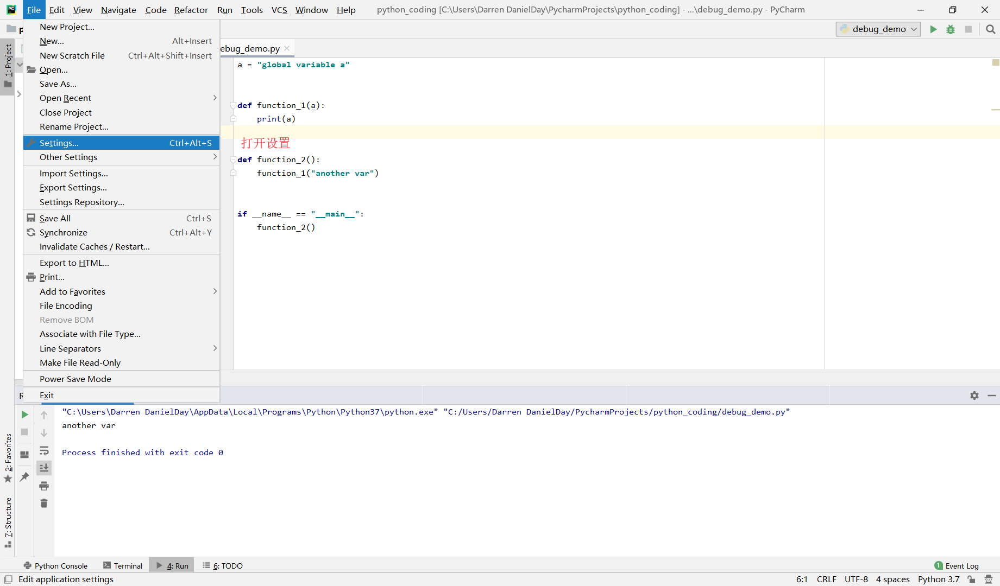
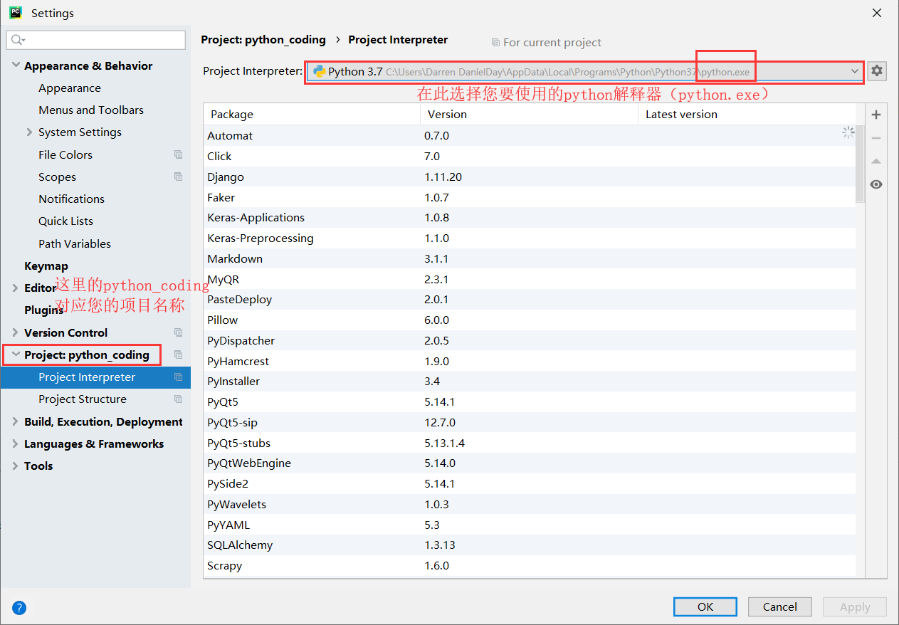

您可以通过两种主要的方式运行您的脚本：

1. 运行当前脚本
2. 配置运行选项，运行特定脚本

要运行当前脚本，您可以右键单击脚本的空白处，然后选择Run。


您将看到这样的结果：


通过以上方法运行过一次以后，pycharm将会为您生成一个运行配置。您可以使用这个配置，点击左上角的绿色小三角形运行。

下面笔者将介绍如何手动配置运行配置。


配置完毕后，您可以选择需要的配置，然后点击右上角的绿色小三角形运行。

Pycharm的调试功能，笔者也用一张图简单概括，仅介绍界面。有关调试的一些概念详见vscode的调试部分。


至此，您已经阅读完本文的内容。

*Enjoy!*
